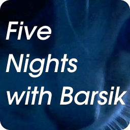

This document is available in the following languages: [Russian (ru-RU)](/docs/README_ru-RU.md), [Ukrainian (uk-UA)](/docs/README_uk-UA.md), **American English (en-US)**, [Brazilian Portuguese (pt-BR)](/docs/README_pt-BR.md), [Mexican Spanish (es-MX)](/docs/README_es-MX.md).

  

This repository contains parts of the source code of the video game "Five Nights with Barsik", its changelogs, documentation, localization files, and other assets for free use (within the terms of the licenses) on wikis, video thumbnails, in fan games, for creating your own modifications (forks) of the game, and other places.

## Game Description

You are Antonio. One night, you notice unknown stray cats and robotic toys in your house. After failing to remove them, you seek help from PsyCo—a company founded by psychologists who study paranormal phenomena. Now everyone—you, the cats, and the toys—are part of an important experiment supervised by Genndy, a PsyCo employee. You must survive five hellish nights with these bloodthirsty intruders.

## Repository Contents

* [👾 Sprites](/sprites/)
* [📖 Documentation](/docs/)
* [🌐 Localizations](/langs/)
* [📋 Changelogs](/changelogs/)
* [📚 Wiki archive](/wiki/)

## About the Source Code

Currently, [Deflecta is developing an open update 2.4 for "Five Nights with Barsik"](https://github.com/RushanM/Five-Nights-with-Barsik/issues/2). This version's code will be open-sourced and published in this repository. At the moment, the repository doesn't contain the source code file, but includes other game materials.

## Extensions Used in the Source File

If you plan to open the game's source file, install these extensions. Otherwise, you won't be able to open it.

* Analog Joystick Object
* Android Plus Object
* Control X
* Discord Rich Presence
* File Object
* Google Play Games Achievements
* Google Play Games Cloud
* Google Play Games Connector
* Google Play Games Leaderboards
* Ini Object
* Joystick 2 Object
* Layer Object
* OS Object
* SDL Joystick Object
* Window Control
* Xbox Gamepad Object

## Important Information

Please, before using the project, familiarize yourself with the following materials:

* [📜 License](/LICENSE.md) - the legal basis for using the project
* [👤 Attribution samples](/ATTRIBUTION.md) - how to properly credit authorship when using the project
* [⚒️ Terms of use](/TERMS_OF_USE.md) - rules for applying the project in various scenarios
* [🤝 Contribution guidelines](/CONTRIBUTING.md) - rules for contributors and collaboration

## Authors

* **Rushan "Deflecta" Mukhutdinov**: copyright holder, developer, writer, artist since version 2.0, creator of some characters
* **Pavel "P4shtet" Shakhmatov**: creator, developer until version 2.0, artist, photographer, creator of most characters
* **Gleb "GKProduction" Kapustin**: help with development and assets, Russian voice actor for Genndy, support
* **Yuri "Zodli" Grachyov**: American English voice actor
* **Andriana Mantidfly**: tester, creator of some characters
* **Yaroslav "Sallo666" Sipyagin**: tester
* **Gleb Glebov**: tester, support until version 2.0
* **Max "KickDemonAss" Syrkov**: tester
* **Matvey "Barsik" Lebedev**: support
* **Other Games Production**: support
* **Smart Games Team**: support

Thanks to everyone who donated!

---

## External Links

* [Game on GameJolt](https://gamejolt.com/games/fnwb/653514)
* [Game Wiki](https://five-nights-with-barsik.fandom.com/ru/wiki/Вики_серий_«Одна_ночь_с_Котей»_и_«Пять_ночей_с_Барсиком»)
* [VK Game Community](https://vk.com/fivenightswithbarsik)
* [Game on Trashbox](https://trashbox.ru/link/pyat-nochej-u-barsika-android)
* [Game on Google Play (currently hidden)](https://play.google.com/store/apps/details?id=ru.deflecta.fnwb)
